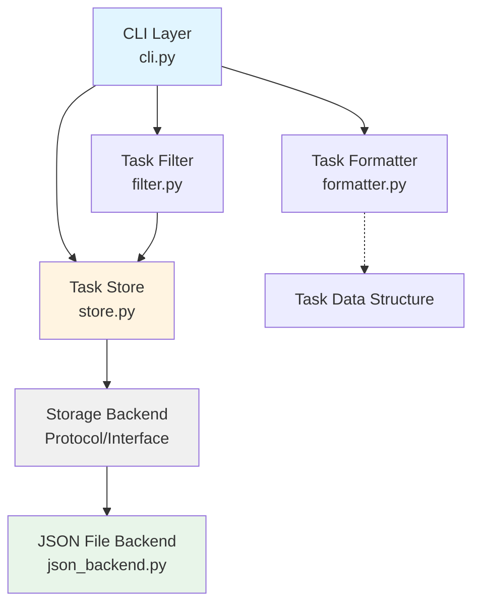

# Design Document: Task Creation and Storage

## Overview

This design specifies the implementation of a task tracker CLI proof-of-concept that demonstrates ATDD with a four-layer test architecture. The system enables users to create tasks with titles, tags, and status, and persists them to a JSON file.

The design emphasizes:

- **Modularity**: Clear separation between CLI, business logic, and storage
- **Testability**: Four-layer test architecture with acceptance and unit tests
- **Simplicity**: Minimal implementation that satisfies requirements
- **Extensibility**: Storage backend abstraction to support future alternatives

### Key Design Decisions

1. **Storage Backend Abstraction**: Define a `StorageBackend` protocol/interface that the `TaskStore` depends on, allowing JSON file implementation to be swapped without changing business logic.

2. **Auto-incrementing IDs**: Task IDs are generated by finding the maximum existing ID and adding 1, ensuring uniqueness and sequential ordering.

3. **ISO Timestamps**: Use Python's `datetime.isoformat()` for creation timestamps, ensuring consistent formatting and timezone handling.

4. **Validation at CLI Layer**: Input validation (empty title, invalid status) occurs at the CLI layer before reaching the store, providing immediate user feedback.

5. **Real Implementations in Tests**: No mocking of internal modules (TaskStore, TaskFilter, TaskFormatter) since all code is under our control. Only external third-party dependencies would be mocked.

## Behavioral Specifications (Gherkin)

This section translates all EARS acceptance criteria from requirements.md into executable specifications using Given-When-Then scenarios in pure domain language.

### Requirement 1: Create Tasks

**1.1 - User provides a title**

```gherkin
Scenario: User creates task with title
  Given the task tracker is ready
  When the user creates a task with title "Write documentation"
  Then a task exists with title "Write documentation"
```

**1.2 - User provides tags**

```gherkin
Scenario: User creates task with tags
  Given the task tracker is ready
  When the user creates a task with title "Deploy application" and tags "urgent" and "devops"
  Then a task exists with title "Deploy application" and tags "urgent" and "devops"
```

**1.3 - User provides a status**

```gherkin
Scenario: User creates task with status
  Given the task tracker is ready
  When the user creates a task with title "Review code" and status "complete"
  Then a task exists with title "Review code" and status "complete"
```

**1.4 - User does not provide a status**

```gherkin
Scenario: User creates task without specifying status
  Given the task tracker is ready
  When the user creates a task with title "Fix bug"
  Then a task exists with title "Fix bug" and status "pending"
```

**1.5 - Task is assigned a unique ID**

```gherkin
Scenario: Each task receives a unique identifier
  Given the task tracker is ready
  When the user creates a task with title "First task"
  And the user creates a task with title "Second task"
  And the user creates a task with title "Third task"
  Then each task has a different identifier
```

**1.6 - Task records creation timestamp**

```gherkin
Scenario: Task records when it was created
  Given the task tracker is ready
  When the user creates a task with title "Time-sensitive task"
  Then the task has a creation timestamp
```

### Requirement 2: Persist Tasks to JSON File

**2.1 - Task is written to storage**

```gherkin
Scenario: Created task is persisted
  Given the task tracker is ready
  When the user creates a task with title "Persistent task"
  And the user retrieves all tasks
  Then a task exists with title "Persistent task"
```

**2.2 - Storage location is created if missing**

```gherkin
Scenario: Task tracker initializes storage on first use
  Given the task tracker storage does not exist
  When the user creates a task with title "First ever task"
  Then the task is successfully created
  And a task exists with title "First ever task"
```

**2.3 - New tasks are appended to existing tasks**

```gherkin
Scenario: Multiple tasks are stored together
  Given the task tracker is ready
  When the user creates a task with title "Task one"
  And the user creates a task with title "Task two"
  And the user retrieves all tasks
  Then 2 tasks exist
  And a task exists with title "Task one"
  And a task exists with title "Task two"
```

**2.4 - Storage maintains valid format**

```gherkin
Scenario: Storage remains valid after multiple operations
  Given the task tracker is ready
  When the user creates a task with title "Alpha"
  And the user creates a task with title "Beta"
  And the user creates a task with title "Gamma"
  And the user retrieves all tasks
  Then 3 tasks exist
```

**2.5 - Tasks are read from storage**

```gherkin
Scenario: User retrieves previously created tasks
  Given the task tracker is ready
  And the user has created a task with title "Stored task" and tags "important"
  When the user retrieves all tasks
  Then a task exists with title "Stored task" and tags "important"
```

**2.6 - Invalid storage format returns error**

```gherkin
Scenario: Corrupted storage produces error message
  Given the task tracker storage is corrupted
  When the user attempts to retrieve all tasks
  Then an error message indicates the storage is invalid
```

### Requirement 3: Modular Storage Backend

**Note:** Requirements 3.1-3.5 are architectural constraints verified through code structure, not behavioral scenarios.

### Requirement 4: Task Data Validation

**4.1 - Empty title is rejected**

```gherkin
Scenario: User attempts to create task with empty title
  Given the task tracker is ready
  When the user attempts to create a task with an empty title
  Then the task is not created
  And an error message "Title cannot be empty" is displayed
```

**4.2 - Invalid status is rejected**

```gherkin
Scenario: User attempts to create task with invalid status
  Given the task tracker is ready
  When the user attempts to create a task with title "Test" and status "in-progress"
  Then the task is not created
  And an error message lists valid status values
```

**4.3 - Tags accept string lists**

```gherkin
Scenario: User creates task with multiple tags
  Given the task tracker is ready
  When the user creates a task with title "Tagged task" and tags "work", "urgent", and "backend"
  Then a task exists with title "Tagged task" and tags "work", "urgent", and "backend"
```

**4.4 - Task ID is a positive integer**

```gherkin
Scenario: Task identifiers are positive integers
  Given the task tracker is ready
  When the user creates a task with title "ID test"
  Then the task has an identifier greater than zero
```

**4.5 - Creation timestamp is valid ISO format**

```gherkin
Scenario: Task timestamp follows ISO format
  Given the task tracker is ready
  When the user creates a task with title "Timestamp test"
  Then the task has a valid ISO format timestamp
```

### Requirement 5: Task Retrieval

**5.1 - Retrieve all tasks**

```gherkin
Scenario: User retrieves all tasks
  Given the task tracker is ready
  And the user has created a task with title "Task A"
  And the user has created a task with title "Task B"
  When the user retrieves all tasks
  Then 2 tasks exist
```

**5.2 - Tasks returned in creation order**

```gherkin
Scenario: Tasks are listed in creation order
  Given the task tracker is ready
  When the user creates a task with title "First task"
  And the user creates a task with title "Second task"
  And the user creates a task with title "Third task"
  And the user lists all tasks
  Then the tasks appear in order: "First task", "Second task", "Third task"
```

**5.3 - Retrieve task by ID**

```gherkin
Scenario: User retrieves specific task by identifier
  Given the task tracker is ready
  And the user has created a task with title "Specific task"
  When the user retrieves the task by its identifier
  Then the task has title "Specific task"
```

**5.4 - Non-existent ID returns error**

```gherkin
Scenario: User attempts to retrieve non-existent task
  Given the task tracker is ready
  When the user attempts to retrieve a task with identifier 999
  Then an error message indicates the task was not found
```

**5.5 - Empty storage returns empty list**

```gherkin
Scenario: User retrieves tasks when none exist
  Given the task tracker is ready
  And no tasks have been created
  When the user retrieves all tasks
  Then 0 tasks exist
```

### Requirement 6: Task ID Generation

**6.1 - First task gets ID 1**

```gherkin
Scenario: First task receives identifier 1
  Given the task tracker is ready
  And no tasks have been created
  When the user creates a task with title "Very first task"
  Then the task has identifier 1
```

**6.2 - Subsequent tasks get sequential IDs**

```gherkin
Scenario: Tasks receive sequential identifiers
  Given the task tracker is ready
  When the user creates a task with title "Task 1"
  And the user creates a task with title "Task 2"
  And the user creates a task with title "Task 3"
  Then the tasks have identifiers 1, 2, and 3
```

**6.3 - Next ID is max existing ID plus 1**

```gherkin
Scenario: New task identifier follows maximum existing identifier
  Given the task tracker is ready
  And tasks exist with identifiers 1, 2, and 5
  When the user creates a task with title "New task"
  Then the task has identifier 6
```

**6.4 - Empty storage starts at ID 1**

```gherkin
Scenario: First task in empty storage gets identifier 1
  Given the task tracker is ready
  And no tasks have been created
  When the user creates a task with title "Initial task"
  Then the task has identifier 1
```

**6.5 - Task IDs are unique**

```gherkin
Scenario: No two tasks share the same identifier
  Given the task tracker is ready
  When the user creates 10 tasks
  Then all 10 tasks have different identifiers
```

### Requirement 7: Four-Layer Test Architecture

**Note:** Requirements 7.1-7.7 are testing architecture constraints verified through test code structure, not behavioral scenarios.

## Architecture

### Component Diagram



### Layer Responsibilities

**CLI Layer** (`cli.py`)

- Parse command-line arguments using Click
- Validate user input (empty title, invalid status)
- Coordinate between Store, Filter, and Formatter
- Display output to user

**Task Store** (`store.py`)

- Define `StorageBackend` protocol/interface
- Implement `TaskStore` class that depends on `StorageBackend`
- Generate unique Task IDs
- Generate ISO timestamps
- Validate task data structure
- Delegate persistence to storage backend

**Storage Backend** (`json_backend.py`)

- Implement `JSONFileBackend` class conforming to `StorageBackend` protocol
- Read/write JSON file at `~/.task-tracker/tasks.json`
- Create directory structure if missing
- Maintain valid JSON format
- Handle file I/O errors

**Task Filter** (`filter.py`)

- Filter tasks by criteria (status, tags, etc.)
- Depend only on `TaskStore` interface

**Task Formatter** (`formatter.py`)

- Format task data for display
- Depend only on task data structures

## Components and Interfaces

### Task Data Structure

```python
from typing import TypedDict, List

class Task(TypedDict):
    id: int
    title: str
    tags: List[str]
    status: str  # "pending" or "complete"
    created_at: str  # ISO format timestamp
```

### StorageBackend Protocol

```python
from typing import Protocol, List, Optional

class StorageBackend(Protocol):
    """Protocol defining storage operations for tasks."""

    def save_task(self, task: Task) -> None:
        """Save a single task to storage."""
        ...

    def load_tasks(self) -> List[Task]:
        """Load all tasks from storage."""
        ...

    def get_task_by_id(self, task_id: int) -> Optional[Task]:
        """Retrieve a specific task by ID."""
        ...
```

### TaskStore Interface

```python
class TaskStore:
    """Manages task persistence and retrieval."""

    def __init__(self, backend: StorageBackend):
        """Initialize with a storage backend."""
        self.backend = backend

    def create_task(
        self,
        title: str,
        tags: List[str] = None,
        status: str = "pending"
    ) -> Task:
        """Create a new task with auto-generated ID and timestamp."""
        ...

    def get_all_tasks(self) -> List[Task]:
        """Retrieve all tasks in creation order."""
        ...

    def get_task(self, task_id: int) -> Optional[Task]:
        """Retrieve a task by ID."""
        ...

    def _generate_next_id(self) -> int:
        """Generate the next sequential task ID."""
        ...
```

### JSONFileBackend Implementation

```python
import json
from pathlib import Path
from typing import List, Optional

class JSONFileBackend:
    """JSON file storage backend implementation."""

    def __init__(self, file_path: str = "~/.task-tracker/tasks.json"):
        """Initialize with file path."""
        self.file_path = Path(file_path).expanduser()

    def save_task(self, task: Task) -> None:
        """Append task to JSON file."""
        ...

    def load_tasks(self) -> List[Task]:
        """Load all tasks from JSON file."""
        ...

    def get_task_by_id(self, task_id: int) -> Optional[Task]:
        """Find task by ID in JSON file."""
        ...

    def _ensure_directory_exists(self) -> None:
        """Create directory structure if missing."""
        ...

    def _read_json_file(self) -> List[Task]:
        """Read and parse JSON file."""
        ...

    def _write_json_file(self, tasks: List[Task]) -> None:
        """Write tasks to JSON file."""
        ...
```

## Data Models

### Task Model

| Field        | Type        | Description                         | Validation                      |
| ------------ | ----------- | ----------------------------------- | ------------------------------- |
| `id`         | `int`       | Auto-incrementing unique identifier | Must be positive integer        |
| `title`      | `str`       | Task title                          | Cannot be empty                 |
| `tags`       | `List[str]` | List of tag strings                 | Must be list of strings         |
| `status`     | `str`       | Task status                         | Must be "pending" or "complete" |
| `created_at` | `str`       | ISO format timestamp                | Must be valid ISO timestamp     |

### JSON File Format

```json
[
  {
    "id": 1,
    "title": "Implement task creation",
    "tags": ["development", "cli"],
    "status": "pending",
    "created_at": "2024-01-15T10:30:00.123456"
  },
  {
    "id": 2,
    "title": "Write tests",
    "tags": ["testing"],
    "status": "complete",
    "created_at": "2024-01-15T11:45:00.789012"
  }
]
```

### File Location

- Path: `~/.task-tracker/tasks.json`
- Directory created automatically if missing
- File created automatically on first task creation
- Empty file represented as `[]` (empty JSON array)

## Error Handling

### Validation Errors

**Empty Title**

- Trigger: User provides empty string or whitespace-only string as title
- Response: Raise `ValueError` with message "Title cannot be empty"
- Layer: CLI validation before calling TaskStore

**Invalid Status**

- Trigger: User provides status value other than "pending" or "complete"
- Response: Raise `ValueError` with message "Invalid status. Must be 'pending' or 'complete'"
- Layer: CLI validation before calling TaskStore

**Invalid Task ID**

- Trigger: Attempting to retrieve task with non-positive integer ID
- Response: Raise `ValueError` with message "Task ID must be a positive integer"
- Layer: TaskStore validation

### Storage Errors

**Task Not Found**

- Trigger: Attempting to retrieve task by ID that doesn't exist
- Response: Return `None` (not an exception, allows caller to handle gracefully)
- Layer: TaskStore

**Invalid JSON File**

- Trigger: JSON file exists but contains malformed JSON
- Response: Raise `JSONDecodeError` with descriptive message including file path
- Layer: JSONFileBackend
- Recovery: User must fix or delete the corrupted file

**File Permission Errors**

- Trigger: Cannot read or write to `~/.task-tracker/tasks.json`
- Response: Raise `PermissionError` with descriptive message
- Layer: JSONFileBackend
- Recovery: User must fix file permissions

**Directory Creation Failure**

- Trigger: Cannot create `~/.task-tracker/` directory
- Response: Raise `OSError` with descriptive message
- Layer: JSONFileBackend
- Recovery: User must fix filesystem permissions

### Error Handling Strategy

1. **Fail Fast**: Validate input at the earliest possible layer (CLI)
2. **Descriptive Messages**: All errors include context about what went wrong and how to fix it
3. **No Silent Failures**: Never swallow exceptions or return success when operation failed
4. **Graceful Degradation**: For non-critical errors (task not found), return None rather than raising exception
5. **Let Python Exceptions Propagate**: Don't catch and re-wrap standard library exceptions unless adding value

## Testing Strategy

### Overview

This feature will be tested using a dual approach:

- **Four-layer acceptance tests**: Executable specifications in Gherkin translated to test code
- **Unit tests**: Specific examples, edge cases, and error conditions (~20-30 tests)

### Four-Layer Test Architecture

**Layer 1: Test Cases** (`tests/acceptance/test_task_creation.py`)

- Written in plain domain language matching Gherkin scenarios
- No technical details (no file paths, no JSON, no HTTP)
- Example: "Given the task tracker is ready, when the user creates a task with title 'Write docs', then a task exists with title 'Write docs'"

**Layer 2: DSL** (`tests/acceptance/story_dsl.py`)

- Domain-specific language methods that compose driver operations
- Methods named after user actions: `create_task_with_tags(title, tags)`, `list_all_tasks()`
- Composes multiple driver calls (not single-line proxies)
- Holds all assertions in domain terms

**Layer 3: Protocol Driver** (`tests/acceptance/system_driver.py`)

- Elementary calls to application modules
- One module call per method
- Example: `driver.create_task(title)` calls `TaskStore.create_task()`
- Driver imports define the application structure

**Layer 4: System Under Test**

- Application modules: `store.py`, `json_backend.py`, `cli.py`
- Real implementations (no mocking of internal modules)
- Only external third-party dependencies would be mocked

### Unit Testing

**Purpose**: Test specific examples, edge cases, and error conditions

**Location**: `tests/unit/test_store.py`, `tests/unit/test_json_backend.py`

**Example-Based Tests**:

- First task gets ID 1 (Requirement 6.1)
- Default status is "pending" (Requirement 1.4)
- Empty storage returns empty list (Requirement 5.5)
- Non-existent task ID returns None (Requirement 5.4)
- Invalid JSON file raises error (Requirement 2.6)
- Directory creation on first use (Requirement 2.2)

**Edge Cases**:

- Very long titles (1000+ characters)
- Special characters in titles (unicode, emojis, newlines)
- Large tag lists (100+ tags)
- Empty tag lists
- Whitespace-only titles
- Invalid status values

### Test Coverage Goals

- **Acceptance tests**: ~30 Gherkin scenarios covering all requirements
- **Unit tests**: ~20-30 example and edge case tests
- **Total**: ~50-60 test cases

### Testing Best Practices

1. **Tests First**: Write tests before implementation (TDD/ATDD)
2. **Real Implementations**: Use real TaskStore, JSONFileBackend (no mocking internal code)
3. **Isolated Tests**: Each test creates its own temporary storage location
4. **Fast Tests**: All tests should complete in < 5 seconds total
5. **Clear Failures**: Test failures should clearly indicate which behavior was violated

### Test Execution

```bash
# Run all tests
make test

# Run only acceptance tests
make test-acceptance

# Run only unit tests
make test-unit

# Run with coverage
pytest --cov=task_tracker --cov-report=html
```
