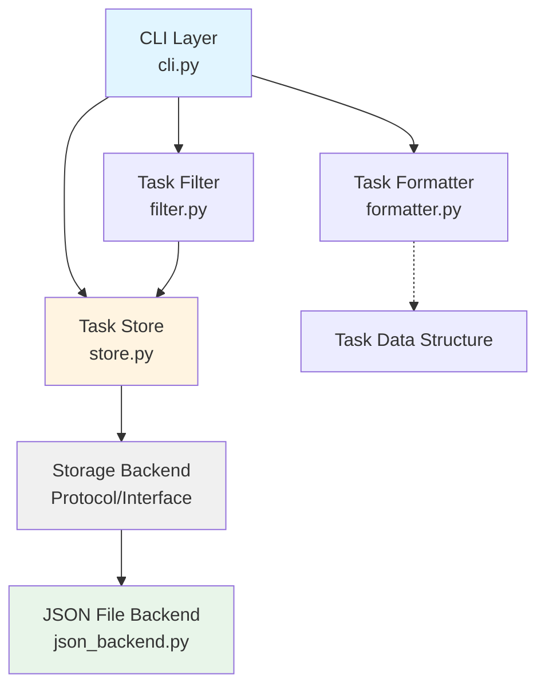

# Design Document: Task Creation and Storage

## Overview

This design specifies the implementation of a task tracker CLI proof-of-concept that demonstrates ATDD with a four-layer test architecture. The system enables users to create tasks with titles, tags, and status, and persists them to a JSON file at `~/.task-tracker/tasks.json`.

The design emphasizes:

- **Modularity**: Clear separation between CLI, business logic, and storage
- **Testability**: Four-layer test architecture with acceptance and unit tests
- **Simplicity**: Minimal implementation that satisfies requirements
- **Extensibility**: Storage backend abstraction to support future alternatives

### Key Design Decisions

1. **Storage Backend Abstraction**: Define a `StorageBackend` protocol/interface that the `TaskStore` depends on, allowing JSON file implementation to be swapped without changing business logic.

2. **Auto-incrementing IDs**: Task IDs are generated by finding the maximum existing ID and adding 1, ensuring uniqueness and sequential ordering.

3. **ISO Timestamps**: Use Python's `datetime.isoformat()` for creation timestamps, ensuring consistent formatting and timezone handling.

4. **Validation at CLI Layer**: Input validation (empty title, invalid status) occurs at the CLI layer before reaching the store, providing immediate user feedback.

5. **Real Implementations in Tests**: No mocking of internal modules (TaskStore, TaskFilter, TaskFormatter) since all code is under our control. Only external third-party dependencies would be mocked.

## Architecture

### Component Diagram



### Layer Responsibilities

**CLI Layer** (`cli.py`)

- Parse command-line arguments using Click
- Validate user input (empty title, invalid status)
- Coordinate between Store, Filter, and Formatter
- Display output to user

**Task Store** (`store.py`)

- Define `StorageBackend` protocol/interface
- Implement `TaskStore` class that depends on `StorageBackend`
- Generate unique Task IDs
- Generate ISO timestamps
- Validate task data structure
- Delegate persistence to storage backend

**Storage Backend** (`json_backend.py`)

- Implement `JSONFileBackend` class conforming to `StorageBackend` protocol
- Read/write JSON file at `~/.task-tracker/tasks.json`
- Create directory structure if missing
- Maintain valid JSON format
- Handle file I/O errors

**Task Filter** (`filter.py`)

- Filter tasks by criteria (status, tags, etc.)
- Depend only on `TaskStore` interface

**Task Formatter** (`formatter.py`)

- Format task data for display
- Depend only on task data structures

## Components and Interfaces

### Task Data Structure

```python
from typing import TypedDict, List

class Task(TypedDict):
    id: int
    title: str
    tags: List[str]
    status: str  # "pending" or "complete"
    created_at: str  # ISO format timestamp
```

### StorageBackend Protocol

```python
from typing import Protocol, List, Optional

class StorageBackend(Protocol):
    """Protocol defining storage operations for tasks."""

    def save_task(self, task: Task) -> None:
        """Save a single task to storage."""
        ...

    def load_tasks(self) -> List[Task]:
        """Load all tasks from storage."""
        ...

    def get_task_by_id(self, task_id: int) -> Optional[Task]:
        """Retrieve a specific task by ID."""
        ...
```

### TaskStore Interface

```python
class TaskStore:
    """Manages task persistence and retrieval."""

    def __init__(self, backend: StorageBackend):
        """Initialize with a storage backend."""
        self.backend = backend

    def create_task(
        self,
        title: str,
        tags: List[str] = None,
        status: str = "pending"
    ) -> Task:
        """Create a new task with auto-generated ID and timestamp."""
        ...

    def get_all_tasks(self) -> List[Task]:
        """Retrieve all tasks in creation order."""
        ...

    def get_task(self, task_id: int) -> Optional[Task]:
        """Retrieve a task by ID."""
        ...

    def _generate_next_id(self) -> int:
        """Generate the next sequential task ID."""
        ...
```

### JSONFileBackend Implementation

```python
import json
from pathlib import Path
from typing import List, Optional

class JSONFileBackend:
    """JSON file storage backend implementation."""

    def __init__(self, file_path: str = "~/.task-tracker/tasks.json"):
        """Initialize with file path."""
        self.file_path = Path(file_path).expanduser()

    def save_task(self, task: Task) -> None:
        """Append task to JSON file."""
        ...

    def load_tasks(self) -> List[Task]:
        """Load all tasks from JSON file."""
        ...

    def get_task_by_id(self, task_id: int) -> Optional[Task]:
        """Find task by ID in JSON file."""
        ...

    def _ensure_directory_exists(self) -> None:
        """Create directory structure if missing."""
        ...

    def _read_json_file(self) -> List[Task]:
        """Read and parse JSON file."""
        ...

    def _write_json_file(self, tasks: List[Task]) -> None:
        """Write tasks to JSON file."""
        ...
```

## Data Models

### Task Model

| Field        | Type        | Description                         | Validation                      |
| ------------ | ----------- | ----------------------------------- | ------------------------------- |
| `id`         | `int`       | Auto-incrementing unique identifier | Must be positive integer        |
| `title`      | `str`       | Task title                          | Cannot be empty                 |
| `tags`       | `List[str]` | List of tag strings                 | Must be list of strings         |
| `status`     | `str`       | Task status                         | Must be "pending" or "complete" |
| `created_at` | `str`       | ISO format timestamp                | Must be valid ISO timestamp     |

### JSON File Format

```json
[
  {
    "id": 1,
    "title": "Implement task creation",
    "tags": ["development", "cli"],
    "status": "pending",
    "created_at": "2024-01-15T10:30:00.123456"
  },
  {
    "id": 2,
    "title": "Write tests",
    "tags": ["testing"],
    "status": "complete",
    "created_at": "2024-01-15T11:45:00.789012"
  }
]
```

### File Location

- Path: `~/.task-tracker/tasks.json`
- Directory created automatically if missing
- File created automatically on first task creation
- Empty file represented as `[]` (empty JSON array)

## Correctness Properties

_A property is a characteristic or behavior that should hold true across all valid executions of a system—essentially, a formal statement about what the system should do. Properties serve as the bridge between human-readable specifications and machine-verifiable correctness guarantees._

### Property Reflection

After analyzing all acceptance criteria, I identified the following testable properties. During reflection, I consolidated redundant properties:

- Properties 1.5 and 6.5 both test ID uniqueness → Combined into Property 5
- Properties 1.6 and 4.5 both test ISO timestamp format → Combined into Property 6
- Properties 2.1 and 2.5 both test persistence round-trip → Combined into Property 7
- Properties 6.1 and 6.4 both test first task ID → Kept as example test, not property

The following properties represent the minimal set of universal correctness guarantees:

### Property 1: Task Creation Preserves Title

_For any_ non-empty title string, creating a task with that title SHALL result in a task object containing the exact title provided.

**Validates: Requirements 1.1**

### Property 2: Task Creation Preserves Tags

_For any_ list of tag strings, creating a task with those tags SHALL result in a task object containing the exact tags provided.

**Validates: Requirements 1.2**

### Property 3: Task Creation Preserves Status

_For any_ valid status value ("pending" or "complete"), creating a task with that status SHALL result in a task object with that exact status.

**Validates: Requirements 1.3**

### Property 4: Empty Title Rejection

_For any_ string composed entirely of whitespace (including empty string), attempting to create a task with that title SHALL be rejected with an error message "Title cannot be empty".

**Validates: Requirements 4.1**

### Property 5: Task ID Uniqueness

_For any_ sequence of task creations, each task SHALL be assigned a unique Task_ID, with no two tasks ever sharing the same ID.

**Validates: Requirements 1.5, 6.5**

### Property 6: ISO Timestamp Format

_For any_ task creation, the created_at field SHALL contain a valid ISO format timestamp string.

**Validates: Requirements 1.6, 4.5**

### Property 7: Persistence Round-Trip

_For any_ task created and persisted to storage, reading the task back from storage SHALL return a task with identical data (id, title, tags, status, created_at).

**Validates: Requirements 2.1, 2.5**

### Property 8: Task List Append Preservation

_For any_ existing list of tasks and any new task, persisting the new task SHALL result in storage containing all previous tasks plus the new task, with no previous tasks modified or removed.

**Validates: Requirements 2.3**

### Property 9: JSON Format Invariant

_For any_ sequence of task creation and persistence operations, the JSON file SHALL remain parseable as valid JSON at all times.

**Validates: Requirements 2.4**

### Property 10: Invalid Status Rejection

_For any_ status value outside the set {"pending", "complete"}, attempting to create a task with that status SHALL be rejected with an error message listing valid status values.

**Validates: Requirements 4.2**

### Property 11: Tags Accept String Lists

_For any_ list of string values, creating a task with those values as tags SHALL be accepted without error.

**Validates: Requirements 4.3**

### Property 12: Positive Integer IDs

_For any_ task created, the Task_ID SHALL be a positive integer (greater than zero).

**Validates: Requirements 4.4**

### Property 13: Creation Order Preservation

_For any_ sequence of task creations, retrieving all tasks SHALL return them in the same order they were created.

**Validates: Requirements 5.2**

### Property 14: Sequential ID Assignment

_For any_ sequence of task creations starting from empty storage, Task_IDs SHALL be assigned sequentially (1, 2, 3, ...) with no gaps.

**Validates: Requirements 6.2**

### Property 15: Next ID Algorithm

_For any_ existing set of tasks with various IDs, creating a new task SHALL assign it an ID equal to the maximum existing Task_ID plus 1.

**Validates: Requirements 6.3**

## Error Handling

### Validation Errors

**Empty Title**

- Trigger: User provides empty string or whitespace-only string as title
- Response: Raise `ValueError` with message "Title cannot be empty"
- Layer: CLI validation before calling TaskStore

**Invalid Status**

- Trigger: User provides status value other than "pending" or "complete"
- Response: Raise `ValueError` with message "Invalid status. Must be 'pending' or 'complete'"
- Layer: CLI validation before calling TaskStore

**Invalid Task ID**

- Trigger: Attempting to retrieve task with non-positive integer ID
- Response: Raise `ValueError` with message "Task ID must be a positive integer"
- Layer: TaskStore validation

### Storage Errors

**Task Not Found**

- Trigger: Attempting to retrieve task by ID that doesn't exist
- Response: Return `None` (not an exception, allows caller to handle gracefully)
- Layer: TaskStore

**Invalid JSON File**

- Trigger: JSON file exists but contains malformed JSON
- Response: Raise `JSONDecodeError` with descriptive message including file path
- Layer: JSONFileBackend
- Recovery: User must fix or delete the corrupted file

**File Permission Errors**

- Trigger: Cannot read or write to `~/.task-tracker/tasks.json`
- Response: Raise `PermissionError` with descriptive message
- Layer: JSONFileBackend
- Recovery: User must fix file permissions

**Directory Creation Failure**

- Trigger: Cannot create `~/.task-tracker/` directory
- Response: Raise `OSError` with descriptive message
- Layer: JSONFileBackend
- Recovery: User must fix filesystem permissions

### Error Handling Strategy

1. **Fail Fast**: Validate input at the earliest possible layer (CLI)
2. **Descriptive Messages**: All errors include context about what went wrong and how to fix it
3. **No Silent Failures**: Never swallow exceptions or return success when operation failed
4. **Graceful Degradation**: For non-critical errors (task not found), return None rather than raising exception
5. **Let Python Exceptions Propagate**: Don't catch and re-wrap standard library exceptions unless adding value

## Testing Strategy

### Overview

This feature will be tested using a dual approach:

- **Property-based tests**: Verify universal properties across randomized inputs (100+ iterations per property)
- **Example-based unit tests**: Verify specific examples, edge cases, and error conditions

### Property-Based Testing

**Library**: `hypothesis` (Python property-based testing library)

**Configuration**: Minimum 100 iterations per property test to ensure comprehensive input coverage

**Test Organization**:

- Location: `tests/unit/test_store_properties.py`
- Each property from the design document maps to one property-based test
- Each test tagged with comment: `# Feature: task-creation-and-storage, Property N: [property text]`

**Property Test Examples**:

```python
from hypothesis import given, strategies as st

# Feature: task-creation-and-storage, Property 1: Task Creation Preserves Title
@given(title=st.text(min_size=1).filter(lambda s: s.strip()))
def test_task_creation_preserves_title(title):
    store = TaskStore(JSONFileBackend())
    task = store.create_task(title=title)
    assert task["title"] == title

# Feature: task-creation-and-storage, Property 5: Task ID Uniqueness
@given(num_tasks=st.integers(min_value=1, max_value=100))
def test_task_id_uniqueness(num_tasks):
    store = TaskStore(JSONFileBackend())
    tasks = [store.create_task(title=f"Task {i}") for i in range(num_tasks)]
    ids = [task["id"] for task in tasks]
    assert len(ids) == len(set(ids))  # All IDs are unique
```

**Generators**:

- Titles: Non-empty strings with various lengths and characters
- Tags: Lists of strings (empty lists, single tags, multiple tags)
- Status: Random choice from {"pending", "complete"}
- Invalid inputs: Empty strings, whitespace, invalid status values
- Task sequences: Random numbers of tasks with varying data

### Unit Testing

**Purpose**: Test specific examples, edge cases, and error conditions not covered by properties

**Location**: `tests/unit/test_store.py`, `tests/unit/test_json_backend.py`

**Example-Based Tests**:

- First task gets ID 1 (Requirement 6.1)
- Default status is "pending" (Requirement 1.4)
- Empty storage returns empty list (Requirement 5.5)
- Non-existent task ID returns None (Requirement 5.4)
- Invalid JSON file raises error (Requirement 2.6)
- Directory creation on first use (Requirement 2.2)

**Edge Cases**:

- Very long titles (1000+ characters)
- Special characters in titles (unicode, emojis, newlines)
- Large tag lists (100+ tags)
- Empty tag lists
- Concurrent task creation (if applicable)

### Four-Layer Test Architecture

**Layer 1: Test Cases** (`tests/acceptance/test_task_creation.py`)

- Written in plain domain language
- No technical details (no file paths, no JSON, no HTTP)
- Example: "Given I have created 3 tasks, when I list all tasks, then I see 3 tasks"

**Layer 2: DSL** (`tests/acceptance/story_dsl.py`)

- Domain-specific language methods
- Compose multiple driver operations
- Example: `create_task_with_tags(title, tags)` calls driver to create task and verify it exists

**Layer 3: Protocol Driver** (`tests/acceptance/system_driver.py`)

- Elementary calls to application modules
- One module call per method
- Example: `driver.create_task(title)` calls `TaskStore.create_task()`

**Layer 4: System Under Test**

- Application modules: `store.py`, `json_backend.py`, `cli.py`
- Real implementations (no mocking of internal modules)

### Test Coverage Goals

- **Property tests**: 15 properties × 100 iterations = 1500+ test cases
- **Unit tests**: ~20 example and edge case tests
- **Acceptance tests**: ~10 end-to-end scenarios
- **Total**: ~1530 test executions

### Testing Best Practices

1. **Tests First**: Write tests before implementation (TDD/ATDD)
2. **Real Implementations**: Use real TaskStore, JSONFileBackend (no mocking internal code)
3. **Isolated Tests**: Each test creates its own temporary storage location
4. **Fast Tests**: Property tests should complete in < 5 seconds total
5. **Clear Failures**: Test failures should clearly indicate which property was violated

### Test Execution

```bash
# Run all tests
make test

# Run only property-based tests
pytest tests/unit/test_store_properties.py -v

# Run only unit tests
make test-unit

# Run only acceptance tests
make test-acceptance

# Run with coverage
pytest --cov=task_tracker --cov-report=html
```
